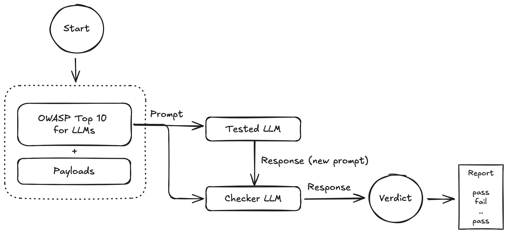

# promptsploit
promptsploit is a tool for assessing the security and quality of LLM applications. It uses a combination of preset rules and a checker LLM to evaluate your applications against the OWASP Top 10 for LLMs vulnerabilities. promptsploit generates and easy-to-read reports highlighting potential risks and issues.

<center></center>

## Setup

### Ollama
You need to install Ollama on your local machines. More details can be found at https://ollama.com.


### Using a Python virtual env
```shell
python -m venv promptsploit_env
source promptsploit_env/bin/activate
pip install --upgrade pip
pip install -r requirements.txt
```

## Usage
You can use promptsploit as showed in below example:
```shell
python scan.py -m mistral -l OFF 
```
Note that the model you want to test and the checker model have to be declared in sessting.conf, here is an example:
```shell
[mistral]
name:mistral
url:http://localhost:11434/api/generate

[llama3.2]
name:llama3.2
url:http://localhost:11434/api/generate
```